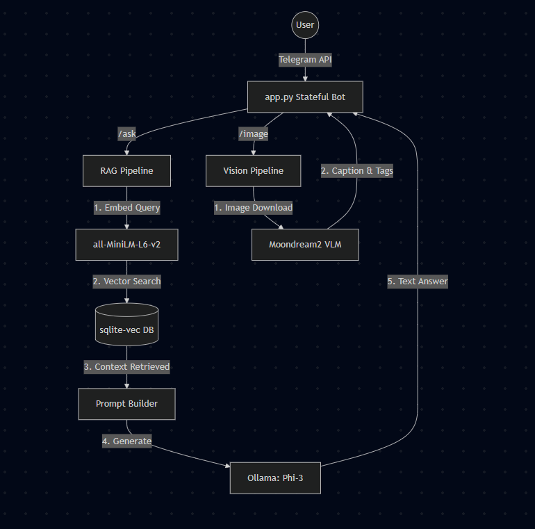

```markdown
# Multimodal Trading RAG & Vision Telegram Bot

A local, privacy-focused Telegram bot that acts as a trading assistant. The system utilizes a Retrieval-Augmented Generation (RAG) pipeline to answer queries based on local PDF documents and a local Vision-Language Model (VLM) to analyze and describe uploaded images. All AI processing executes entirely on the host machine.

## System Design



## Prerequisites

The host system must have the following installed:
1. **Python 3.10+**
2. **Git**
3. **Ollama:** Download from [ollama.com](https://ollama.com/).
4. **Nvidia GPU (Recommended):** Required for hardware acceleration using CUDA.

## Setup Instructions

### Step 1: Install and Configure Ollama
Ollama serves as the local LLM engine for the RAG pipeline.
1. Install Ollama on the host machine.
2. Open a terminal or command prompt.
3. Download the Phi-3 model:
   ```bash
   ollama pull phi3
   ```
4. Ensure Ollama remains running in the background.

### Step 2: Clone the Repository
Download the project source code to the local machine.
```bash
git clone <repository-url>
cd "Doc Image Helper"
```

### Step 3: Initialize the Python Environment
Create an isolated virtual environment to manage dependencies.
```bash
python -m venv venv
```
Activate the virtual environment:
* **Windows:**
  ```cmd
  venv\Scripts\activate
  ```
* **Mac/Linux:**
  ```bash
  source venv/bin/activate
  ```

### Step 4: Install Dependencies
To enable hardware acceleration on Nvidia GPUs, the CUDA-specific version of PyTorch must be installed before the general requirements.

1. **Install PyTorch with CUDA 12.1 support (Windows):**
   ```cmd
   pip install torch torchvision torchaudio --index-url [https://download.pytorch.org/whl/cu121](https://download.pytorch.org/whl/cu121)
   ```
2. **Install remaining dependencies:**
   ```cmd
   pip install -r requirements.txt
   ```

### Step 5: Configure the Telegram API Token
1. Obtain a Bot API Token from **@BotFather** on Telegram.
2. In the root directory, create a `.env` file (or copy the provided `.env.example` file).
3. Insert the token into the `.env` file using the following format:
   ```text
   TELEGRAM_BOT_TOKEN=insert_actual_token_here
   ```

### Step 6: Build the Vector Database
The system requires source documents to populate the RAG pipeline.
1. Create a directory named `NIFTY_50` within the project root.
2. Place target trading PDFs into the `NIFTY_50` directory.
3. Execute the ingestion script to chunk the text, generate embeddings, and build the local SQLite database (`rag.db`):
   ```bash
   python ingest.py
   ```

### Step 7: Launch the Application
Start the main bot process:
```bash
python app.py
```
*Note: During the initial execution, the script automatically downloads the Moondream2 vision model weights (~3.7GB) to the local cache. Subsequent executions will bypass this download.*

## Usage & Commands

Users interact with the bot via a persistent Telegram keyboard menu or standard text commands.

* `/start` or `/help` - Displays the main navigation menu.
* `/ask` - Prompts the user for a text query. The system searches the local database and returns an answer citing source documents.
* `/summarize` - Generates a summary of the user's last three interactions.
* `/image` - Prompts the user to upload an image for visual analysis.

### ⚠️ Critical Note on Image Uploads
When uploading an image to the bot via Telegram, **the user must send it as a standard compressed photo.** Do not upload the image as an uncompressed "File" or "Document". Sending uncompressed files bypasses standard image handling and causes the Telegram API download request to fail. 
1. Tap the attachment icon.
2. Select the image from the gallery.
3. Tap Send directly.
```